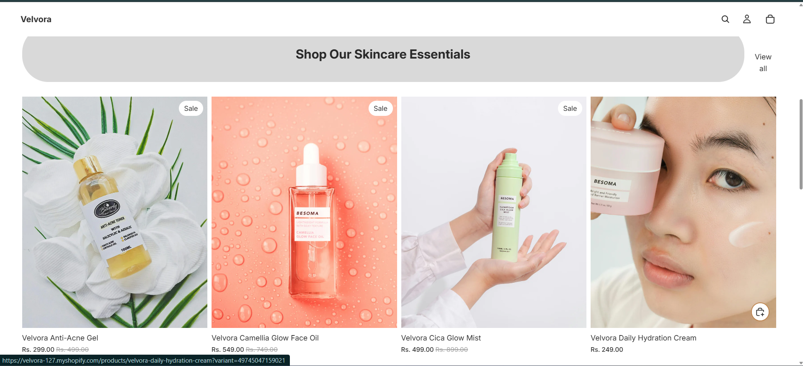
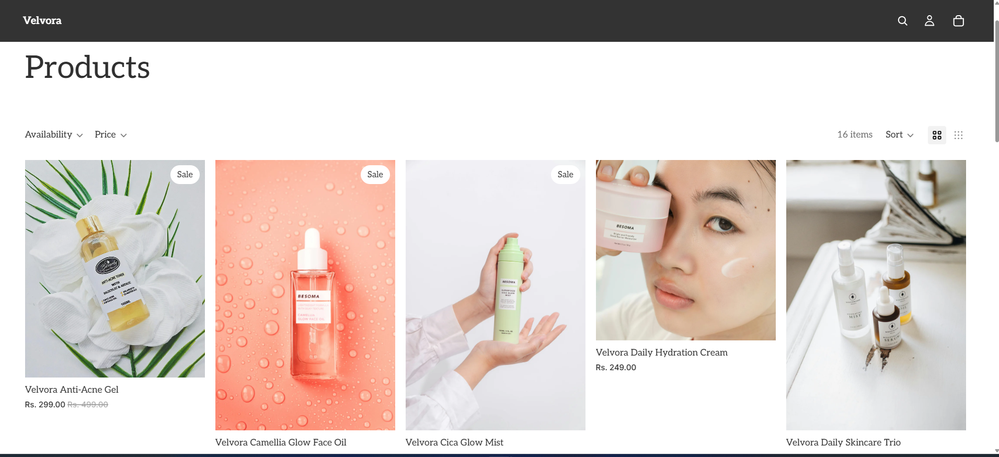
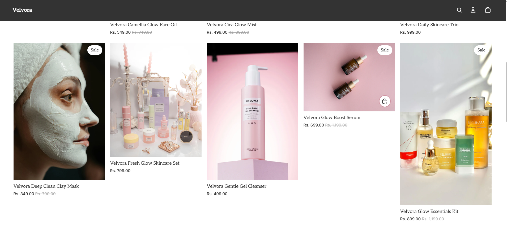

# 🌿 Velvora – Shopify Skincare Store

Velvora is a modern skincare e-commerce store built using Shopify, focused on delivering a clean, minimal, and user-friendly shopping experience.

This project highlights my ability to design, structure, and manage a complete online store with product listings, filters, cart functionality, and checkout flow.

---

## ✨ Key Highlights

- 🛍️ Built a fully functional Shopify store
- 📦 Managed 10+ skincare products with pricing & variants
- 🎯 Designed clean and responsive UI
- 🔍 Implemented product filtering (price & availability)
- 🛒 Integrated cart and checkout system
- 👤 Added customer login interface

---

## 🛠️ Tools & Skills

- Shopify Store Development  
- Product Management  
- UI/UX Design  
- E-commerce Workflow  
- Store Customization  

---

## 🖼️ Store Preview

### 🏠 Homepage

---

### 🛍️ Product Listings
  
  

---

### 📦 Collections

---

### 🧴 Product Details
  

---

### 🔍 Filters
  

---

### 🛒 Cart Experience

---

### 💳 Checkout

---

### 👤 User Login

---

## 📌 Project Overview

This project demonstrates my capability to create a structured and visually appealing e-commerce store using Shopify. I focused on product organization, smooth navigation, and user experience to simulate a real-world online skincare brand.

---

## 🔗 Live Store

👉 https://velvora-127.myshopify.com

---

## 🚀 Future Improvements

- Add customer reviews & ratings  
- Enhance branding (logo & theme styling)  
- Optimize for mobile performance  
- Integrate payment & shipping customization  

---

## 🙌 Conclusion

Velvora represents my hands-on experience with Shopify and my understanding of e-commerce workflows, from product setup to final checkout.
