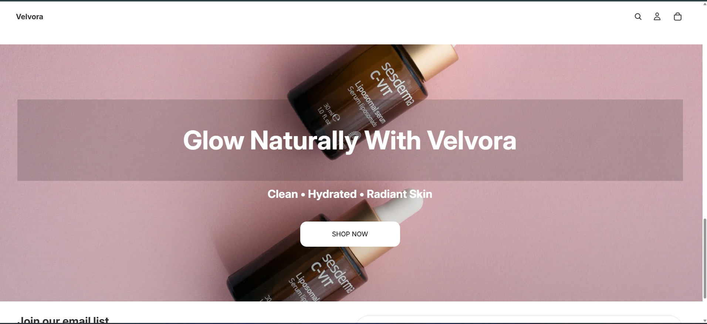
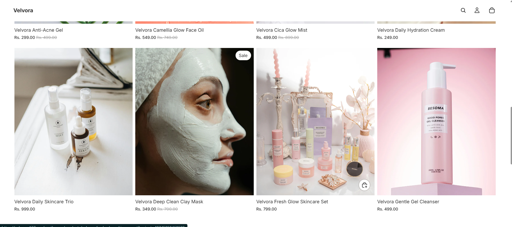
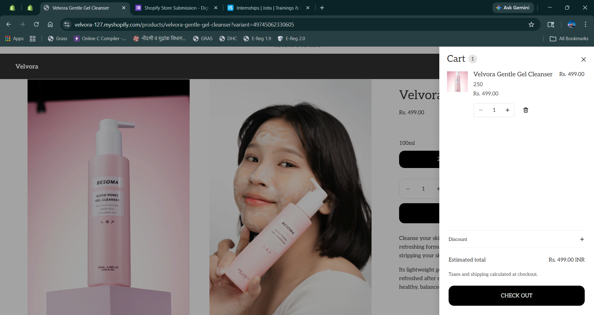
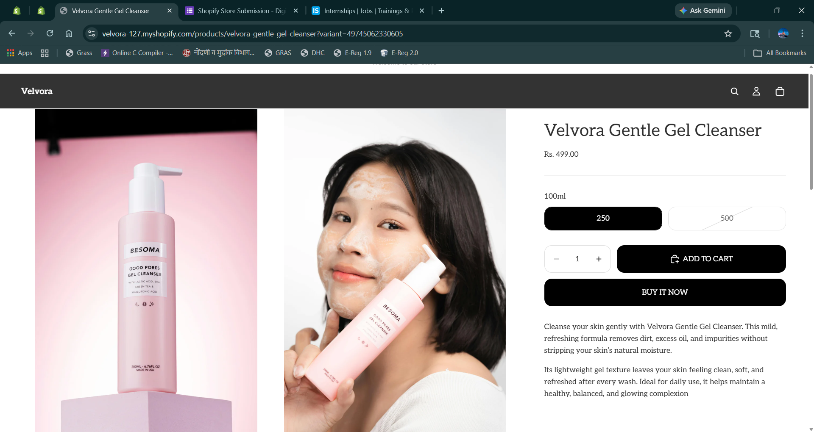
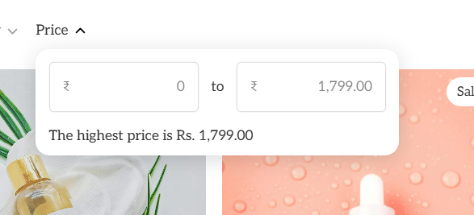
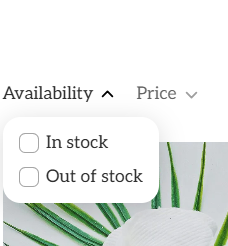
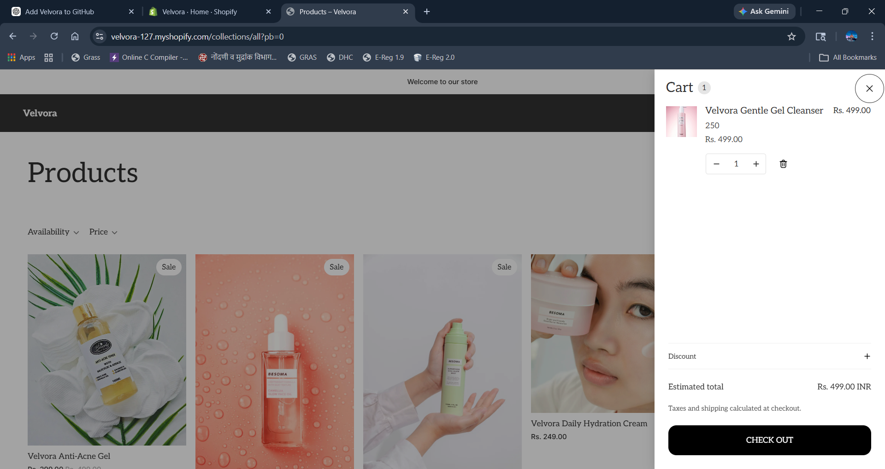
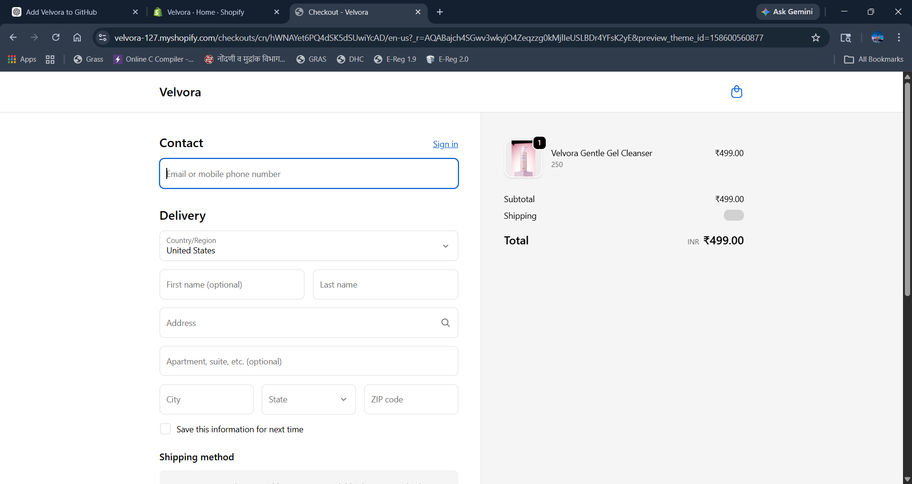
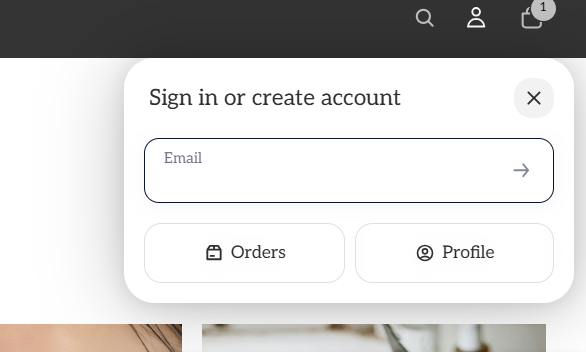

# 🌿 Velvora – Shopify Skincare Store

Velvora is a modern skincare e-commerce store built using Shopify, focused on delivering a clean, minimal, and user-friendly shopping experience.

This project demonstrates my ability to design, structure, and manage a complete online store, including product listings, filtering, cart functionality, and checkout flow.

---

## ✨ Key Highlights

- 🛍️ Built a fully functional Shopify store  
- 📦 Added and managed 10+ skincare products  
- 🎯 Designed a clean and responsive UI  
- 🔍 Implemented product filters (price & availability)  
- 🛒 Integrated cart and checkout system  
- 👤 Added user login functionality  

---

## 🛠️ Tools & Skills

- Shopify Store Development  
- Product Management  
- UI/UX Design  
- E-commerce Workflow  
- Store Customization  

---

## 🖼️ Store Preview

### 🏠 Homepage

---

### 🛍️ Products

---

### 📦 Collection Page

---

### 🧴 Product Details
  

---

### 🔍 Filters
  

---

### 🛒 Cart

---

### 💳 Checkout

---

### 👤 Login

---

## 🔗 Live Store

👉 https://velvora-127.myshopify.com  

🔐 **Store Password:** Velvora123  

> Note: This store is in development mode. Use the password above to explore the full functionality including product browsing, cart, and checkout experience.

---

## 📌 Project Overview

This project showcases my ability to build a structured and visually appealing e-commerce store using Shopify. I handled product uploads, pricing, collections, and overall store design to create a smooth and intuitive shopping experience.

---

## 🚀 Future Improvements

- Add customer reviews and ratings  
- Improve branding (logo and theme customization)  
- Optimize for mobile responsiveness  
- Integrate advanced payment and shipping options  

---

## 🙌 Conclusion

Velvora represents my hands-on experience with Shopify and my understanding of real-world e-commerce workflows, from product setup to checkout.
